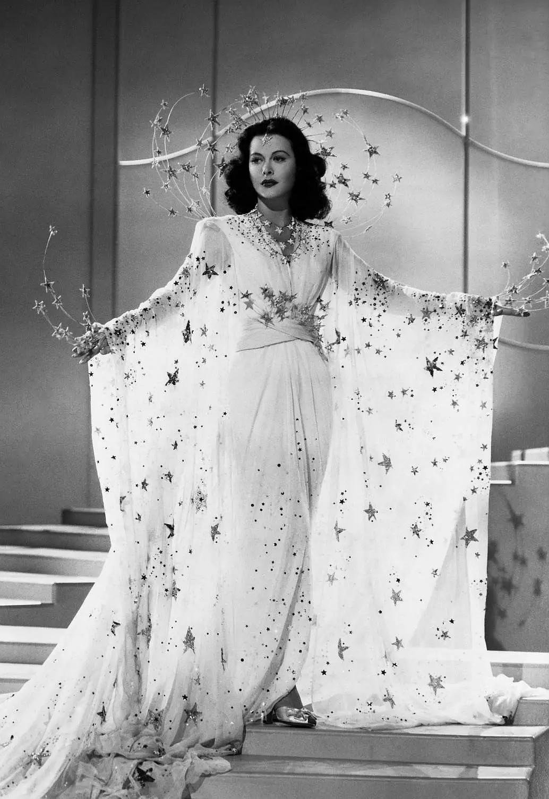

---

title:  "WIFI之母的介绍"
subtitle: "海蒂·拉玛（Hedy Lamarr）的安利"
author: "仙人腿扎掌"
avatar: "assets/images/authors/author.jpg"
image: "assets/images/Hedy-Lamarr-03.jpg"

---

# 科技遇见她

## her story 

### ——Hedy Lamarr's story

海蒂·拉玛，1914年11月9日出生于奥地利，匈牙利犹太人后裔，著名的美国演员，展频（Spread Spectrum）技术共同发明人。

她从小家境优越，有着惊人的美貌（在记录片中，被称为“那个可怕的孩子”）同时，还有一个聪明的头脑：五岁的时候就能把一个音乐盒拆掉重装，（我一个在中学拼拼图拼到发脾气的人在此处留下眼泪）上学时更是在化学、数学课表现很好。

她美而自知，在燃起对电影的兴趣之后，便独自走进奥地利最大的电影厂，利用美貌为自己赢得了角色，并从龙套逐渐成长为著名女演员。（在1933年，她被半哄骗半胁迫地拍了有全裸镜头的《神魂颠倒(Ecstasy)》并一炮走红）

但，美貌是利刃，伤人也可以伤己。她因为此片，在后来好莱坞时期饱受花瓶形象困扰（后来连出个记录片，前面都要加个“尤物”，此处应有白眼），留下经典名言：

#### _Any girl can look glamorous, all she has to do is stand still and look stupid._

说出如此一针见血的话的女人，自然是没有想要浪费自己的聪明脑袋。她对发明的热爱从未消失。  
她在短短几个月中，她仅靠旁听其军火商丈夫的谈话，掌握了当时属于最高级别军事机密的无线电通信技术。

此后，她由于纳粹的原因出走到了美国，也没有停止过钻研。她认为一定有方法能解决当时无线信号容易被干扰的问题并做了不少设想，而这些设想，在遇到乔治·安塞尔，一位钢琴家后，终于得到激发。二人一拍即合，完成了名为秘密通信系统（Secret Communications System)的专利，并在美国专利局获得了2292387的专利号。海蒂研究这个技术的原因是想要为对抗纳粹出力。她们二人在获得专利后，并没有开发商业用途，而是交给了政府，想要帮助改进鱼雷无线电操控技术。

  然而，军方并不感兴趣，甚至认为她是间谍，剽窃得来的创意，把她赶去推销战争债券。海蒂去了，筹得了两千五百万没有的战争债券，但也放弃了继续深入这项研究。而这项发明专利更是在战后被没收了，一直到1997年，专利发明56年后，她们二人的成就才获得认可。

然后发现有人和我一样意难平：  
这是一篇以海蒂为女主角的小说，《陪达芬奇超神的日子》

### [陪达芬奇超神的日子]: (http://www.jjwxc.net/onebook.php?novelid=3617949/) 

记录片：

<iframe src="//player.bilibili.com/player.html?aid=74684489&bvid=BV1mE411B7RS&cid=128169500&page=1" scrolling="no" border="0" frameborder="no" framespacing="0" allowfullscreen="true"> </iframe>
